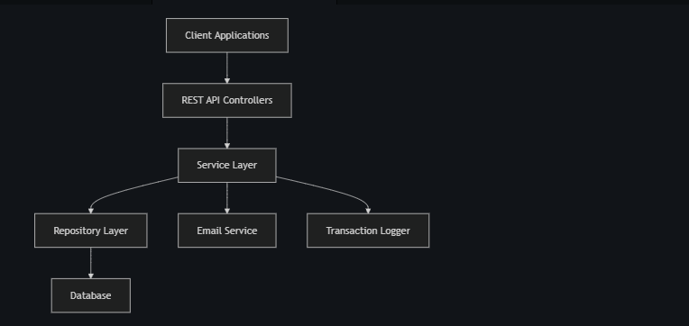

This banking system backend implementation fulfills all the requirements :

1. ✅ Customer management with registration and details
2. ✅ Account management with balance tracking
3. ✅ Transaction processing (deposits and withdrawals)
4. ✅ Money transfers between accounts
5. ✅ Transaction records and history
6. ✅ Email notifications for transactions
7. ✅ Message logging for all transactions


The system is built using:

- Spring Boot for the backend framework
- JPA/Hibernate for database operations
- PostgreSQL as the relational database
- RESTful API design principles
- Proper exception handling and validation
- Email service integration

System Architecture


Database schema

    CUSTOMER {
        long id PK
        string firstName
        string lastName
        string email
        string mobile
        date dob
        datetime lastUpdateDateTime
    }
    ACCOUNT {
        long id PK
        long customerId FK
        string accountNumber
        decimal balance
        string accountType
        datetime creationDate
    }
    TRANSACTION {
        long id PK
        long accountId FK
        string type
        decimal amount
        datetime bankingDateTime
        string status
    }
    TRANSFER {
        long id PK
        long fromAccountId FK
        long toAccountId FK
        decimal amount
        datetime bankingDateTime
        string status
    }
    MESSAGE {
        long id PK
        long customerId FK
        string message
        datetime dateTime
    }
    
    CUSTOMER ||--o{ ACCOUNT : "has"
    ACCOUNT ||--o{ TRANSACTION : "performs"
    ACCOUNT ||--o{ TRANSFER : "sends"
    ACCOUNT ||--o{ TRANSFER : "receives"
    CUSTOMER ||--o{ MESSAGE : "receives"

## 

```typescriptreact project="Student Management System"
...
```

## Testing the Banking System API with Swagger/Postman

After implementing the backend, you can test the API using Swagger or Postman. Here's how to test each endpoint:

### 1. Customer Management

#### Register a Customer

```plaintext
POST /api/customers
```

```json
{
  "firstName": "John",
  "lastName": "Doe",
  "email": "john.doe@example.com",
  "mobile": "1234567890",
  "dob": "1990-01-01"
}
```

#### Get All Customers

```plaintext
GET /api/customers
```

#### Get Customer by ID

```plaintext
GET /api/customers/{id}
```

#### Update Customer

```plaintext
PUT /api/customers/{id}
```

```json
{
  "firstName": "John",
  "lastName": "Doe",
  "email": "john.updated@example.com",
  "mobile": "1234567890",
  "dob": "1990-01-01"
}
```

#### Delete Customer

```plaintext
DELETE /api/customers/{id}
```

### 2. Account Management

#### Create Account

```plaintext
POST /api/accounts
```

```json
{
  "customerId": 1,
  "accountType": "SAVINGS",
  "initialDeposit": 1000.00
}
```

#### Get All Accounts for a Customer

```plaintext
GET /api/accounts/customer/{customerId}
```

#### Get Account by ID

```plaintext
GET /api/accounts/{id}
```

#### Get Account by Number

```plaintext
GET /api/accounts/number/{accountNumber}
```

#### Delete Account

```plaintext
DELETE /api/accounts/{id}
```

### 3. Transaction Management

#### Process Transaction (Deposit/Withdrawal)

```plaintext
POST /api/transactions
```

```json
{
  "accountId": 1,
  "type": "DEPOSIT",
  "amount": 500.00
}
```

or

```json
{
  "accountId": 1,
  "type": "WITHDRAWAL",
  "amount": 200.00
}
```

#### Get Transaction by ID

```plaintext
GET /api/transactions/{id}
```

#### Get All Transactions for an Account

```plaintext
GET /api/transactions/account/{accountId}
```

#### Get Transactions by Date Range

```plaintext
GET /api/transactions/account/{accountId}/date-range?start=2023-01-01T00:00:00&end=2023-12-31T23:59:59
```

### 4. Transfer Management

#### Process Transfer

```plaintext
POST /api/transfers
```

```json
{
  "sourceAccountId": 1,
  "destinationAccountId": 2,
  "amount": 300.00
}
```

#### Get Transfer by ID

```plaintext
GET /api/transfers/{id}
```

#### Get Outgoing Transfers

```plaintext
GET /api/transfers/source-account/{accountId}
```

#### Get Incoming Transfers

```plaintext
GET /api/transfers/destination-account/{accountId}
```

#### Get Transfers by Date Range

```plaintext
GET /api/transfers/account/{accountId}/date-range?start=2023-01-01T00:00:00&end=2023-12-31T23:59:59&isSource=true
```

### 5. Message Management

#### Get Messages for a Customer

```plaintext
GET /api/messages/customer/{customerId}
```

**Start the application**: Run your Spring Boot application.
**Register a user**: Use Postman or any API client to register a user:

```plaintext
POST /api/auth/signup
{
  "username": "testuser",
  "email": "test@example.com",
  "password": "password123",
  "role": ["user"]
}
```


**Login to get a JWT token**:

```plaintext
POST /api/auth/signin
{
  "username": "testuser",
  "password": "password123"
}
```

This will return a JWT token.


**Create a customer with the token**:

```plaintext
POST /api/customers
Headers: 
Authorization: Bearer <your_jwt_token>

Body:
{
  "firstName": "John",
  "lastName": "Doe",
  "email": "john.doe@example.com",
  "mobile": "1234567890",
  "dob": "1990-01-01"
}
```


**Test public access**: For testing purposes, you can also create a customer without authentication:

```plaintext
POST /api/customers
{
  "firstName": "Jane",
  "lastName": "Doe",
  "email": "jane.doe@example.com",
  "mobile": "0987654321",
  "dob": "1992-05-15"
}
```